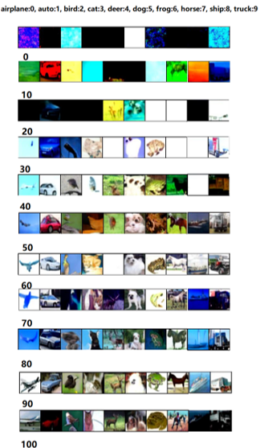
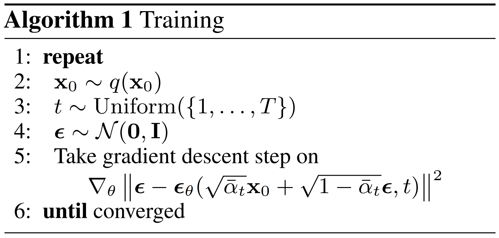
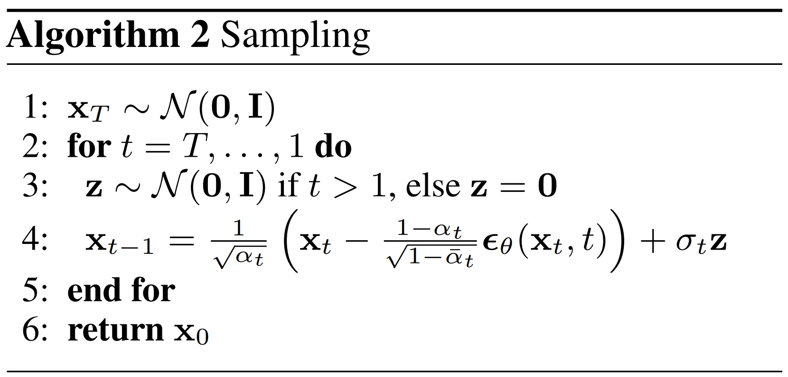

# Denoising Diffusion Probabilistic Models

去噪扩散模型，根据论文 [Denoising Diffusion Probabilistic Models (DDPM)](https://arxiv.org/pdf/2006.11239.pdf) 实现,  `ddpm_conditional.py` 是根据类别进行训练和生成图像。 `ddpm_conditional.py` 代码实现了Classifier-Free-Guidance (CFG) & Exponential-Moving-Average (EMA)。

参考代码链接：

[https://github.com/dome272/Diffusion-Models-pytorch](https://github.com/dome272/Diffusion-Models-pytorch)

[https://github.com/tcapelle/Diffusion-Models-pytorch](https://github.com/tcapelle/Diffusion-Models-pytorch)

参考视频YouTube链接：

<a href="https://www.youtube.com/watch?v=HoKDTa5jHvg">
   
</a>
<a href="https://www.youtube.com/watch?v=TBCRlnwJtZU">
   
</a>

参考视频B站链接：

<a href="https://www.bilibili.com/video/BV1ze4y1b75E/">
   
</a>
<a href="https://www.bilibili.com/video/BV1we4y1H7gG/">
   
</a>

<hr>

## 目录

```bash
    .
    │  ddpm_conditional.py  # 1.扩散模型主程序，实现了DDPM类，和训练代码
    │  modules.py           # 2.网络模块，实现了Unet和Unet_conditional
    │  utils.py             # 3.一些辅助工具
    │  README.md            # 说明
    │
    ├─imgs                  # 存放一些图片
    │
    ├─models                # 模型权重文件夹
    │  └─DDPM_conditional
    │
    ├─results               # 训练过程中采样图文件夹
    │  └─DDPM_conditional
    │
    └─runs                  # 运行日志文件夹
       └─DDPM_conditional
```


## 数据集

[CIFAR-10 64x64](https://www.kaggle.com/datasets/joaopauloschuler/cifar10-64x64-resized-via-cai-super-resolution), 10 classes

```
    airplane:0, 
    auto:1, 
    bird:2, 
    cat:3, 
    deer:4, 
    dog:5, 
    frog:6, 
    horse:7, 
    ship:8, 
    truck:9
```

## 有条件训练，Training

```bash
    python ddpm_conditional.py
```

## 采样，Sampling

```python
    n = 10
    device = "cuda"
    model = UNet_conditional(num_classes=10).to(device)
    ckpt = torch.load("conditional_ema_ckpt.pt")
    model.load_state_dict(ckpt)
    diffusion = Diffusion(img_size=64, device=device)
    y = torch.Tensor([6] * n).long().to(device)
    x = diffusion.sample(model, n, y, cfg_scale=3)
    plot_images(x)
```

## 部分结果图



## 算法简介

训练|采样
-|-
|

## 核心代码1：Diffusion 类，训练代码

<details open>
<summary>展开/折叠</summary>

```py
class Diffusion:
    def __init__(self, noise_steps=1000, beta_start=1e-4, beta_end=0.02, img_size=256, device="cuda"):
        self.noise_steps = noise_steps
        self.beta_start = beta_start
        self.beta_end = beta_end
        self.img_size = img_size
        self.device = device

        self.beta = self.prepare_noise_schedule().to(device)
        self.alpha = 1. - self.beta
        self.alpha_hat = torch.cumprod(self.alpha, dim=0)

    def prepare_noise_schedule(self):
        '''
        Generate noise beta of each time step
        return: shape (noise_steps, )
        '''
        return torch.linspace(self.beta_start, self.beta_end, self.noise_steps)

    def sample_timesteps(self, n):
        '''
        Sample time steps for each image
        input:
            n: batch_size, int
        return:
            t: time_step, shape (n, ), values in [1, noise_step]
        '''
        return torch.randint(low=1, high=self.noise_steps, size=(n, ))

    def noise_images(self, x, t):
        '''
        Add noise process: x_0 -> x_{t}
        input:
            x: input_images, shape (batch_size, 1, img_size, img_size)
            t: time_step, int
        return:
            noise_images: shape (batch_size, 1, img_size, img_size)
            noise: shape (batch_size, 1, img_size, img_size)
            noise_images = sqrt(alpha_hat[t]) * x + sqrt(1 - alpha_hat[t]) * noise
        '''
        sqrt_alpha_hat = torch.sqrt(self.alpha_hat[t])[:, None, None, None]
        sqrt_one_minus_alpha_hat = torch.sqrt(1 - self.alpha_hat[t])[:, None, None, None]
        Ɛ = torch.randn_like(x)
        return sqrt_alpha_hat * x + sqrt_one_minus_alpha_hat * Ɛ, Ɛ

    def sample(self, model, n, labels, cfg_scale=3):
        '''
        Denoise process: x_{t} -> x_{t-1} -> ... -> x_0
        input:
            model: nn.Module
            n: batch_size, int
            labels: shape (n, ), values in [0, 9]
            cfg_scale: float, 0.0 ~ 1.0, 0.0: unconditioned diffusion, 1.0: conditioned diffusion
        return:
            x_0: images in t0, shape (n, 1, img_size, img_size), values in [0, 255]
            sampled_images (x_{t-1}) = 1 / sqrt(alpha[t]) * (noisy_images (x_t) - (1 - alpha[t]) / sqrt(1 - alpha_hat[t]) * predicted_noise) + sqrt(beta[t]) * noise
        '''
        logging.info(f"Sampling {n} new images....")
        model.eval()
        with torch.no_grad():
            x = torch.randn((n, 3, self.img_size, self.img_size)).to(self.device)
            for i in tqdm(reversed(range(1, self.noise_steps)), position=0):
                t = (torch.ones(n) * i).long().to(self.device)
                predicted_noise = model(x, t, labels)
                # interpolate with unconditioned diffusion
                if cfg_scale > 0:
                    uncond_predicted_noise = model(x, t, None)
                    # predicted_noise = predicted_noise * cfg_scale + uncond_predicted_noise * (1 - cfg_scale)
                    predicted_noise = torch.lerp(uncond_predicted_noise, predicted_noise, cfg_scale)
                alpha = self.alpha[t][:, None, None, None]
                alpha_hat = self.alpha_hat[t][:, None, None, None]
                beta = self.beta[t][:, None, None, None]
                if i > 1:
                    noise = torch.randn_like(x)
                else:
                    noise = torch.zeros_like(x)
                x = 1 / torch.sqrt(alpha) * (x - ((1 - alpha) / (torch.sqrt(1 - alpha_hat))) * predicted_noise) + torch.sqrt(beta) * noise
        model.train()
        x = (x.clamp(-1, 1) + 1) / 2
        x = (x * 255).type(torch.uint8)
        return x


def train(args):
    '''
    Training process: 
    each epoch, each batch, rand_time_step, compare the predicted noise with the real noise
    '''
    setup_logging(args.run_name)
    device = args.device
    dataloader = get_data(args)
    model = UNet_conditional(num_classes=args.num_classes).to(device)
    optimizer = optim.AdamW(model.parameters(), lr=args.lr)
    mse = nn.MSELoss()
    diffusion = Diffusion(img_size=args.image_size, device=device)
    logger = SummaryWriter(os.path.join("runs", args.run_name))
    l = len(dataloader)
    ema = EMA(0.995)
    ema_model = copy.deepcopy(model).eval().requires_grad_(False)

    for epoch in range(args.epochs):
        logging.info(f"Starting epoch {epoch}/{args.epochs}:")
        pbar = tqdm(dataloader)
        for i, (images, labels) in enumerate(pbar):
            images = images.to(device)
            labels = labels.to(device)
            t = diffusion.sample_timesteps(images.shape[0]).to(device)
            x_t, noise = diffusion.noise_images(images, t)
            # 10% of the time, don't pass labels, unconditioned diffusion
            if np.random.random() < 0.1:
                labels = None
            predicted_noise = model(x_t, t, labels)
            loss = mse(noise, predicted_noise)

            optimizer.zero_grad()
            loss.backward()
            optimizer.step()
            ema.step_ema(ema_model, model)

            pbar.set_postfix(MSE=loss.item())
            logger.add_scalar("MSE", loss.item(), global_step=epoch * l + i)

        if epoch % 10 == 0:
            labels = torch.arange(10).long().to(device)
            sampled_images = diffusion.sample(model, n=len(labels), labels=labels)
            ema_sampled_images = diffusion.sample(ema_model, n=len(labels), labels=labels)
            # plot_images(sampled_images)
            save_images(sampled_images, os.path.join("results", args.run_name, f"{epoch}.jpg"), nrow=len(labels))
            save_images(ema_sampled_images, os.path.join("results", args.run_name, f"{epoch}_ema.jpg"), nrow=len(labels))
            torch.save(model.state_dict(), os.path.join("models", args.run_name, f"ckpt.pt"))
            torch.save(ema_model.state_dict(), os.path.join("models", args.run_name, f"ema_ckpt.pt"))
            torch.save(optimizer.state_dict(), os.path.join("models", args.run_name, f"optim.pt"))
```
</details>

## 核心代码2：modules

<details open>
<summary>展开/折叠</summary>

```py
class UNet_conditional(nn.Module):
    def __init__(self, c_in=3, c_out=3, time_dim=256, num_classes=None, device="cuda"):
        super().__init__()
        self.device = device
        self.time_dim = time_dim
        self.inc = DoubleConv(c_in, 64)
        self.down1 = Down(64, 128)
        self.sa1 = SelfAttention(128, 32)
        self.down2 = Down(128, 256)
        self.sa2 = SelfAttention(256, 16)
        self.down3 = Down(256, 256)
        self.sa3 = SelfAttention(256, 8)

        self.bot1 = DoubleConv(256, 512)
        self.bot2 = DoubleConv(512, 512)
        self.bot3 = DoubleConv(512, 256)

        self.up1 = Up(512, 128)
        self.sa4 = SelfAttention(128, 16)
        self.up2 = Up(256, 64)
        self.sa5 = SelfAttention(64, 32)
        self.up3 = Up(128, 64)
        self.sa6 = SelfAttention(64, 64)
        self.outc = nn.Conv2d(64, c_out, kernel_size=1)

        if num_classes is not None:
            self.label_emb = nn.Embedding(num_classes, time_dim)

    def pos_encoding(self, t, channels):
        inv_freq = 1.0 / (
            10000
            ** (torch.arange(0, channels, 2, device=self.device).float() / channels)
        )
        pos_enc_a = torch.sin(t.repeat(1, channels // 2) * inv_freq)
        pos_enc_b = torch.cos(t.repeat(1, channels // 2) * inv_freq)
        pos_enc = torch.cat([pos_enc_a, pos_enc_b], dim=-1)
        return pos_enc

    def forward(self, x, t, y):
        t = t.unsqueeze(-1).type(torch.float)
        t = self.pos_encoding(t, self.time_dim)

        if y is not None:
            t += self.label_emb(y)

        x1 = self.inc(x)
        x2 = self.down1(x1, t)
        x2 = self.sa1(x2)
        x3 = self.down2(x2, t)
        x3 = self.sa2(x3)
        x4 = self.down3(x3, t)
        x4 = self.sa3(x4)

        x4 = self.bot1(x4)
        x4 = self.bot2(x4)
        x4 = self.bot3(x4)

        x = self.up1(x4, x3, t)
        x = self.sa4(x)
        x = self.up2(x, x2, t)
        x = self.sa5(x)
        x = self.up3(x, x1, t)
        x = self.sa6(x)
        output = self.outc(x)
        return output
```
</details>